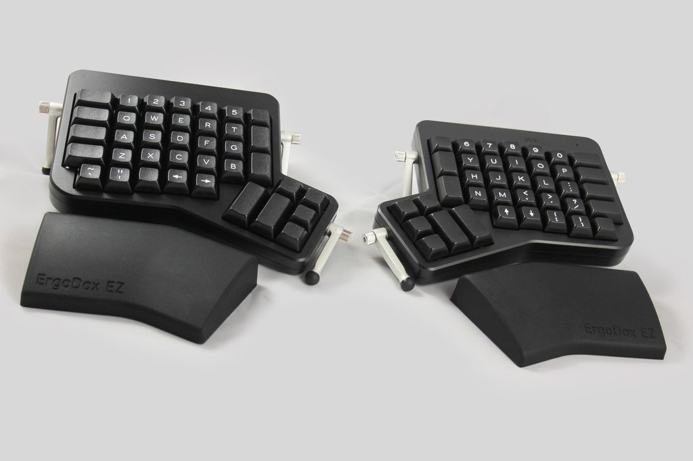

> The **Daws**on optimized setup for the **ergo**dox mechanical keyboard  

## What's ergodox?

A really cool mechanical keyboard. Fully reprogrammable, too. It looks like this:



You can get one [here](https://ergodox-ez.com/)

## Install

Compile within the original qmk_firmware project (in `/keyboards/ergodox/keymaps`).

```sh
git clone git@github.com:jackhumbert/qmk_firmware.git
cd qmk_firmware/keyboards/ergodox/keymaps
git clone git@github.com:dawsonbotsford/ergodaws.git
cd ergodaws
make

# Run Teensy Loader and load ergodaws.hex. Press reset on your ergodox.
```

## Teensy Loader

You'll need [Teensy](https://www.pjrc.com/teensy/loader.html) in order to load the compiled key layout onto the ergodox

## More Help

This is a standard key layout for qmk_firmware, so reading the [main page](https://github.com/jackhumbert/qmk_firmware) will help.

## License

MIT
